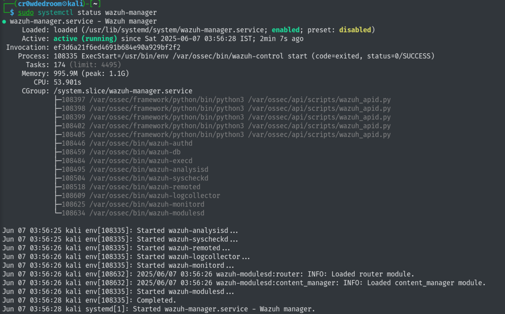
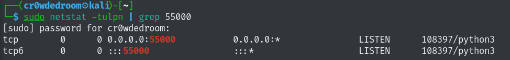
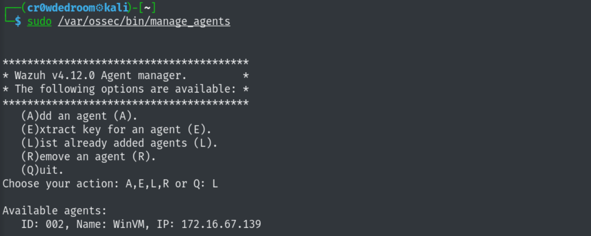
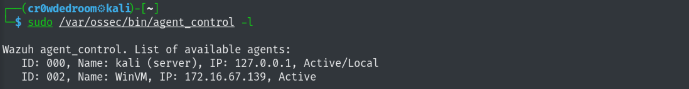

# WinSentinel-Endpoint-Threat-Visibility-and-Detection-Framework

WinSentinel is a security monitoring framework that integrates modern Windows telemetry tools to provide real-time visibility, detection, and investigation capabilities for endpoint threats in a simulated enterprise environment.
This project demonstrates applied SOC Analyst skills by combining Sysmon, Sysinternals, Windows Event Logs, Osquery, and Wazuh SIEM to monitor, log, detect, and alert on suspicious activity across a Windows 11 VM — with Kali Linux used for simulating attacker behavior.

🛡️Project Objectives:

1) Build a robust endpoint logging and detection lab

2) Simulate real-world attacker behavior (recon, persistence, privilege escalation)

3) Detect anomalies using custom Sysmon rules, Osquery packs, and Wazuh alerts

4) Showcase core SOC skills: event correlation, telemetry analysis, and alert triage

## Step 1: Installing and Checking Wazuh Manager Status
Installed the Wazuh Manager on my Kali Linux virtual machine. The Wazuh Manager acts as the central server that collects, analyzes, and stores security data received from various agents.

Installation Summary:
1) Installed using the official Wazuh repository.
2) Followed proper setup steps, ensuring all necessary dependencies were met.
3) Ensured no broken configuration in ossec.conf by validating with xmllint.

Service Activation:
After installation, I started and enabled the Wazuh Manager service and checked the running status.

Wazuh Manager is listening on Port 55000.

## Step 2: Installing Wazuh Agent on Windows 11 & Connecting to Wazuh Manager on Kali VM
To enable endpoint telemetry from the Windows VM, I installed and configured the Wazuh Agent, which forwards event data to the Wazuh Manager running on my Kali Linux system.

On Kali, I generated an authentication key and added the Windows agent with a name and IP address and copied the generated key and pasted it in the Wazuh Agent registration on Windows.

On Kali, I generated an authentication key and added the Windows agent with a name and IP address and copied the generated key and pasted it in the Wazuh Agent registration on Windows.
Installation Summary:
1) Downloaded Wazuh Agent for Windows from the official site.
2) Ran the installer and completed the GUI-based setup.
3) When prompted, I entered:
 
  Manager IP: IP of the Kali VM 
  
  Registration key: Generated from the Wazuh Manager using the manage_agents CLI tool.
  

Started the Wazuh Agent from the GUI on Windows and verified connectivity from Kali.

